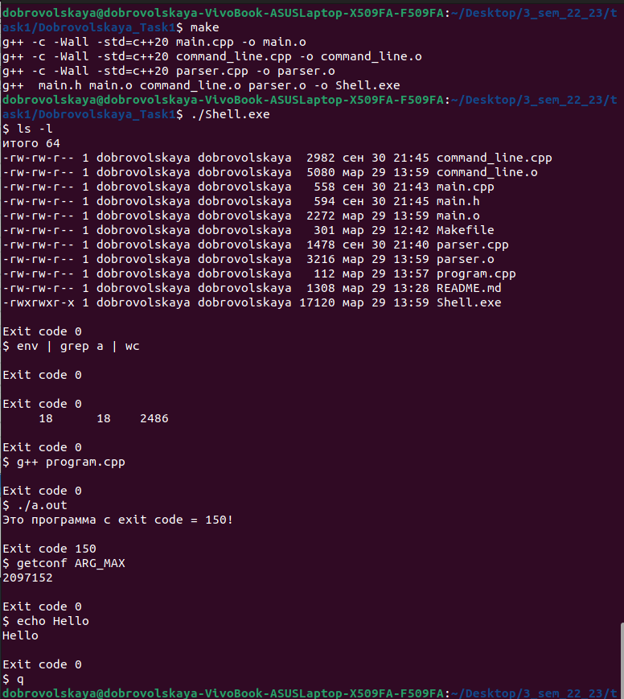

# Shell
  
>Запускает программы, находящиеся в текущей директории, либо в каталогах из переменной PATH.  
>После завершения программы, печатает её exit code.  

Это *программа-оболочка*, которая позволяет:  

+ запускать другие программы через командную строку, циклически получая команды из STDIN и запуская их в дочернем процессе  
+ получить коды выхода завершенных программ  
+ использовать конвейерную обработку программных последовательностей (если между именами программ стоит символ «|»,в этом случае вывод (n-1)-го будет перенаправлен со стандартного вывода на стандартный ввод n-го)  


### Пример работы программы

  


### Сборка

1. Чтобы запустить нужно выполнить:  
```
  $ make  
  $ ./Shell.exe  
```

2. Чтобы остановить:  
```
  $ q  
```
