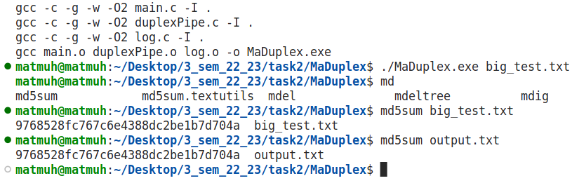

## MaDuplex

### Description

Simple program that implements duplex data transmission. It is done with 2 pipes.

### Test case

To generate 4GB test file and transmit it through duplex pipe use:
```
$ make big_test.txt
$ ./MaDuplex big_test.txt
```
If you want to measure transmission time you can use:
```
$ time ./MaDuplex big_test.txt
```

For me this process took 35 seconds with 65 536 bytes buffer size.

To check correctness of transmission let's look at check-sum:



### Build and run

To transmit light test file (input.txt):

```
$ make
$ ./MaDuplex 
```

To transmit your file:
```
$ make
$ ./MaDuplex filename
```