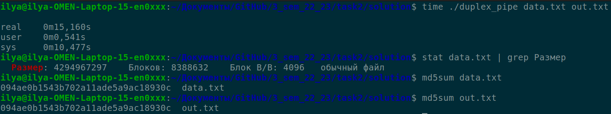

# Duplex pipes realization
This program can transfer data from parent to child and back, using realization of duplex pipes
## Compilation and execution
Compile with: `make all`  
Execute with: `./duplex_pipe [file to transfer] [resulting file]`  
If no argements typed, set default values: `file to transfer = data.txt, resulting file = out.txt`  
Buffer size set as 8 kB, it is optimal value, can redefine SIZE as you need (SIZE in bytes)
## Example

