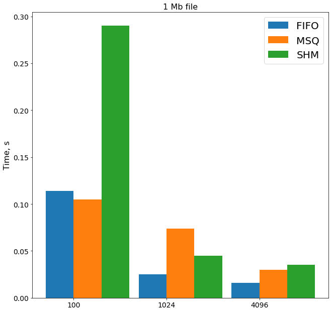
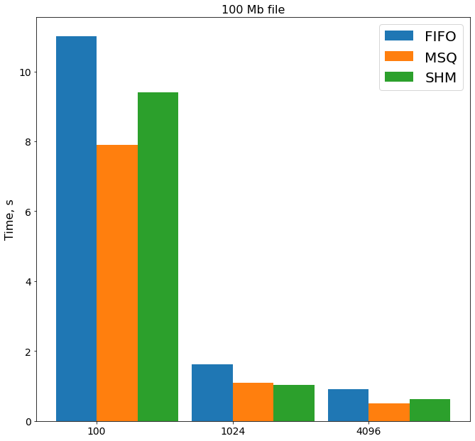

### Comparison of IPCs

In this work I probe several IPCs for file transferring task.

Explored IPCs:
* FIFO
* Message Queue
* Shared Memory

Explored file sizes:
 * 1 Mb
 * 100 Mb
 * 4 Gb
 
Explored buffer sizes:
* 100 b
* 1024 b
* 4096 b

As we see for big files shared memory loses due to time expenses in synchronization.