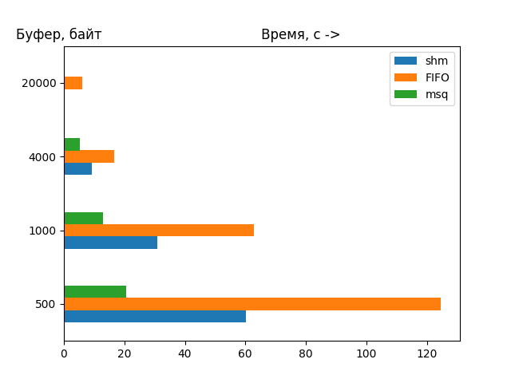
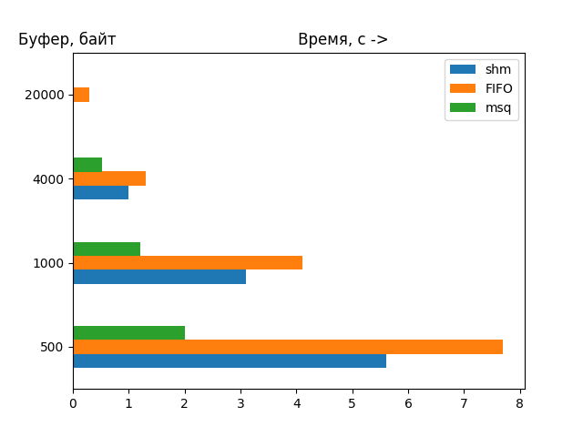
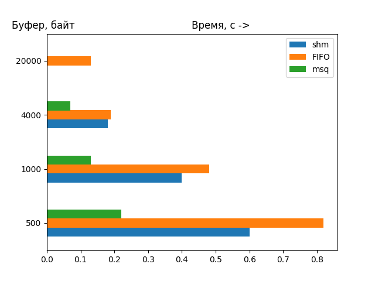

# Разделяемая память SYS V   
>**Разделяемая память** - некоторая область адресного пространства доступная для   
>использования нескольким процессам.  

Программа **shm/main1.c** читает файл *file.txt* порциями размера BF_SIZE и записывает их в разделяемую память  
Программа **shm/main2.c** читает из разделяемой памяти в файл *text.txt*  

1. Чтобы запустить *отправителя* нужно в директории **shm** в первом терминале:
``` 
  $make -f Makefile_send  
  $./shm_send  
``` 
1. Чтобы запустить *получателя* нужно в директории **shm** во втором терминале: 
``` 
  $make -f Makefile_read    
  $./shm_read   
```
-------------------------------------------------------------------------

# FIFO  
>**FIFO** (от **F**irst **I**nput **F**irst **O**utput) или именованный pipe - 
>средство связи для организации потокового взаимодействия любых процессов в 
>щперационной системе UNIX.  

Программа **FIFO/main1.c** читает файл *file.txt* порциями размера BF_SIZE и записывает их в очередь FIFO  
Программа **FIFO/main2.c** читает из FIFO в файл *text.txt*  

1. Чтобы запустить *отправителя* нужно в директории **FIFO** в первом терминале:
``` 
  $make -f Makefile_send  
  $./FIFO_send  
``` 
1. Чтобы запустить *получателя* нужно в директории **FIFO** во втором терминале: 
``` 
  $make -f Makefile_read    
  $./FIFO_read   
```  
-------------------------------------------------------------------------

# Очереди сообщений SYS V  
>**Очереди сообщений** - способ взаимодействия процессов через линии связи, в  
>котором на передаваемую информацию накладывается определенная структура,  
>помогающая принимающему процессу различать порции данных. 


Программа **msq/main1.c** читает файл *file.txt* в сообщения размера BF_SIZE (<4080) и отправляет их в очередь  
Программа **msq/main2.c** вытаскивает сообщения из очереди и записывает их в файл *text.txt*  

1. Чтобы запустить *отправителя* нужно в директории **msq** в первом терминале:
``` 
  $make -f Makefile_send  
  $./msq_send  
``` 
1. Чтобы запустить *получателя* нужно в директории **msq** во втором терминале: 
``` 
  $make -f Makefile_read    
  $./msq_read   
```
-------------------------------------------------------------------------

Здесь представлены такие **средства организации взаимодействия процессов**, как *разделяемая память*, *именованные каналы FIFO* и *очереди сообщений*. Для их сравнения были разработаны пары программ (*отправитель* -> *получатель*), передающие файл произвольного размера между двумя процессами и измерено для каждой время передачи файла *file.txt* размера :  

1. 4.3 Гб  
1. 430 Мб  
1. 43 Мб  

в зависимости от размера данных в одном сообщении(BF_SIZE):  

1. 500 байт    
1. 1000 байт  
1. 4000 байт  
1. 20000 байт  


Время было измерено с использованием утилиты time  

# Файл 4.3 Гб (большой)  
  

# Файл 430 Мб (средний)  
  

# Файл 43 Мб (малый)  
  

По результатам измерений можно сделать следующие выводы о эффективности использования данных средств:  

1. При любых размерах буфера (< 4080) и любых размерах файла самую бытрую передачу осуществляет **очередь сообщений**, особенно выражена скорость при малых размерах файла. Преимущество объясняется тем, что у очередей сообщений обеспечена синхронизация, в остальных же случаях приходилось использовать семафоры.   

1. **Разделяемая память** эффективна (не лучше очередей сообщений) при больших размерах файла и максимально возможных для разделяемой памяти размерах буфера.  

1. Из-за ограничения размера сообщений и количества разделяемой памяти (4080 б) с передачей больших файлов (> 430 Мб) быстрее справляется **FIFO** при огромных размерах буфера, недоступных для остальных средств.  


